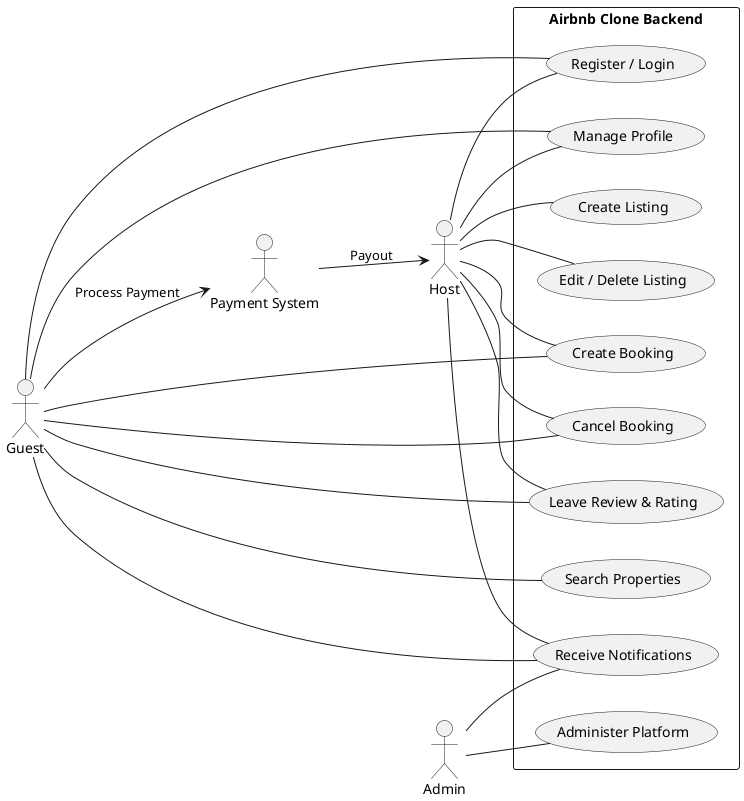

## Use Case Diagram for ALX Airbnb Clone Backend

This directory contains the use case diagram for the core features and functionalities of the Airbnb clone backend, visualizing the interactions between actors and the system.

### Diagram Overview

The use case diagram captures the following **actors** and **use cases**:

| Actor          | Description                                                                    |
| -------------- | ------------------------------------------------------------------------------ |
| Guest          | A user who browses, books, and reviews properties.                             |
| Host           | A user who lists properties and manages bookings.                              |
| Admin          | A system administrator who manages users, listings, and oversees the platform. |
| Payment System | External payment gateway (e.g., Stripe/PayPal).                                |

| Use Case              | Actors Involved       | Description                                                                  |
| --------------------- | --------------------- | ---------------------------------------------------------------------------- |
| Register / Login      | Guest, Host           | Sign up or authenticate via email/password or OAuth (Google, Facebook).      |
| Manage Profile        | Guest, Host           | View and update profile information, including photo and preferences.        |
| Create Listing        | Host                  | Add new property with details (title, description, amenities, availability). |
| Edit / Delete Listing | Host                  | Modify or remove existing property listings.                                 |
| Search Properties     | Guest                 | Search and filter by location, price, guests, amenities, with pagination.    |
| Create Booking        | Guest, Host           | Guest books a property; system prevents double bookings via date validation. |
| Cancel Booking        | Guest, Host           | Cancel an existing booking in accordance with cancellation policy.           |
| Process Payment       | Guest, Payment System | Handle guest payments and host payouts in multiple currencies.               |
| Leave Review & Rating | Guest, Host           | Guest submits review; host may respond. Linked to confirmed bookings.        |
| Receive Notifications | Guest, Host, Admin    | Email / in-app alerts for booking confirmations, cancellations, payments.    |
| Administer Platform   | Admin                 | Manage users, listings, bookings, payments via admin dashboard.              |

### PlantUML Source

Below is a PlantUML script to generate the use case diagram in Draw\.io or any PlantUML-compatible tool. Copy the code into a `.puml` file or directly import into Draw\.io (Arrange → Insert → Advanced → PlantUML).

### File

* **airbnb\_usecase\_diagram.puml**: PlantUML source file.
* **airbnb\_usecase\_diagram.png**: PNG export of the use case diagram.

---

*Next Steps*: Import the PlantUML into Draw\.io, adjust layout/styling as desired, export as `use-case-diagram.png`, and commit both files to this directory in your GitHub repository.
